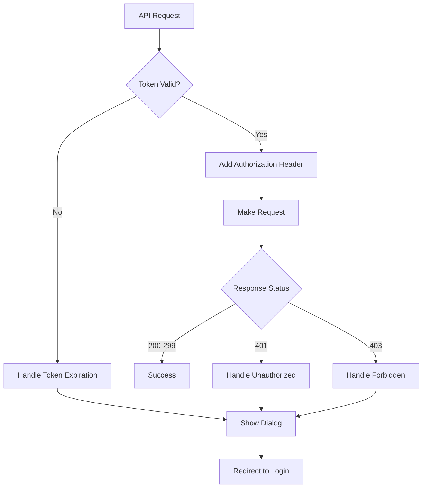

# Token Expiration Handling

This document describes the comprehensive token expiration handling system implemented in the Fundi App to ensure users are redirected to the login screen when their authentication tokens expire.

## Overview

The token expiration handling system consists of multiple components working together to detect expired tokens and redirect users to the login screen seamlessly. This ensures a secure and user-friendly experience when authentication tokens expire.

## Components

### 1. NavigationService (`lib/core/services/navigation_service.dart`)

The `NavigationService` provides global navigation capabilities and handles redirects to the login screen.

**Key Features:**
- Global navigation key for app-wide navigation
- `redirectToLogin()` method to clear navigation stack and redirect to login
- `showTokenExpirationDialog()` to display user-friendly expiration messages
- Prevents duplicate redirects with `_isRedirecting` flag

**Usage:**
```dart
final navigationService = NavigationService();
await navigationService.redirectToLogin(
  reason: 'Your session has expired. Please log in again.',
  clearStack: true,
);
```

### 2. SessionManager (`lib/core/services/session_manager.dart`)

Enhanced session manager that handles token expiration and user logout.

**Key Methods:**
- `handleTokenExpiration()` - Shows dialog and redirects to login
- `forceLogout()` - Clears session and redirects to login
- `clearSession()` - Removes all stored authentication data

**Usage:**
```dart
await sessionManager.handleTokenExpiration(
  reason: 'Your session has expired. Please log in again.',
);
```

### 3. JwtTokenManager (`lib/core/services/jwt_token_manager.dart`)

JWT token validation and expiration detection.

**Key Features:**
- `isTokenValid()` - Checks if token is valid and not expired
- `isTokenExpired()` - Specifically checks for token expiration
- `needsRefresh()` - Checks if token needs refresh (expires within 5 minutes)
- Automatic token expiration handling when expired tokens are detected

**Usage:**
```dart
final isValid = jwtTokenManager.isTokenValid();
if (!isValid) {
  // Token is expired or invalid
}
```

### 4. ApiClient (`lib/core/network/api_client.dart`)

Enhanced API client with comprehensive token expiration handling.

**Key Features:**
- Request interceptor that validates tokens before making requests
- Error interceptor that handles 401 (Unauthorized) and 403 (Forbidden) responses
- Automatic session clearing and login redirect on authentication failures

**Flow:**
1. Before each request: Check if token is valid
2. If invalid: Trigger token expiration handling
3. On 401/403 response: Handle unauthorized access
4. Add JWT token to Authorization header for valid tokens

## Token Expiration Flow

### 1. Token Validation During API Requests



### 2. Token Expiration Handling Process

1. **Detection**: Token expiration is detected in multiple places:
   - During token validation in `JwtTokenManager`
   - During API request interceptor in `ApiClient`
   - On 401/403 API responses

2. **User Notification**: A dialog is shown to inform the user:
   - "Session Expired" title
   - Customizable message explaining the situation
   - OK button to proceed

3. **Session Cleanup**: All stored authentication data is cleared:
   - JWT token removed from storage
   - User data cleared
   - Session state reset

4. **Navigation**: User is redirected to login screen:
   - Navigation stack is cleared
   - Login screen is displayed
   - User must authenticate again

## Implementation Details

### Global Navigation Setup

The `NavigationService` is integrated into the main app through the `navigatorKey`:

```dart
// In main.dart
MaterialApp(
  navigatorKey: NavigationService().navigatorKey,
  // ... other properties
)
```

### Token Expiration Dialog

The system shows a user-friendly dialog when tokens expire:

```dart
await navigationService.showTokenExpirationDialog(
  message: 'Your session has expired. Please log in again.',
  onOkPressed: () async {
    await sessionManager.forceLogout();
  },
);
```

### Automatic Token Validation

Tokens are automatically validated:
- Before each API request
- When checking authentication status
- During app initialization

## Security Considerations

1. **Token Storage**: Tokens are stored in SharedPreferences (consider migrating to flutter_secure_storage)
2. **Session Cleanup**: All authentication data is cleared on expiration
3. **Navigation Stack**: Navigation stack is cleared to prevent back navigation to authenticated screens
4. **Multiple Validation Points**: Token validation occurs at multiple levels for security

## Testing

### Test Utilities

The system includes comprehensive test utilities:

- `TokenExpirationTest` - Utility class for testing token expiration scenarios
- `TokenExpirationTestWidget` - UI widget for testing token expiration functionality

### Test Methods

```dart
// Test token expiration handling
await TokenExpirationTest.testTokenExpiration();

// Test force logout
await TokenExpirationTest.testForceLogout();

// Test navigation redirect
await TokenExpirationTest.testNavigationRedirect();

// Run all tests
await TokenExpirationTest.runAllTests();
```

## Error Handling

The system includes comprehensive error handling:

1. **Graceful Degradation**: If navigation fails, the system logs errors and continues
2. **Fallback Mechanisms**: Multiple fallback options for token expiration handling
3. **Logging**: Comprehensive logging for debugging and monitoring
4. **User Experience**: User-friendly error messages and dialogs

## Best Practices

1. **Consistent Messaging**: Use consistent error messages across the app
2. **User Feedback**: Always inform users when sessions expire
3. **Security**: Clear all authentication data on expiration
4. **Navigation**: Clear navigation stack to prevent back navigation
5. **Testing**: Regularly test token expiration scenarios
6. **Monitoring**: Monitor token expiration events for insights

## Troubleshooting

### Common Issues

1. **Multiple Redirects**: The system prevents duplicate redirects with the `_isRedirecting` flag
2. **Navigation Context**: The `NavigationService` requires a valid navigation context
3. **Token Validation**: Ensure JWT tokens are properly formatted and not corrupted

### Debug Information

Use the debug utilities to troubleshoot issues:

```dart
final debugInfo = TokenExpirationTest.getTokenDebugInfo();
print('Token Debug Info: $debugInfo');
```

## Future Enhancements

1. **Token Refresh**: Implement automatic token refresh before expiration
2. **Secure Storage**: Migrate to flutter_secure_storage for token storage
3. **Background Refresh**: Refresh tokens in background when app becomes active
4. **Analytics**: Track token expiration events for analytics
5. **Custom Messages**: Allow customizable expiration messages per feature

## Conclusion

The token expiration handling system provides a robust, secure, and user-friendly way to handle expired authentication tokens. It ensures users are properly notified and redirected to the login screen while maintaining security and providing a smooth user experience.

